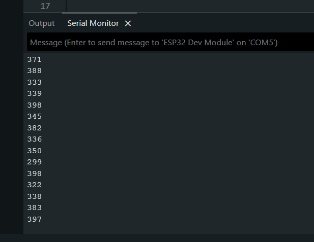
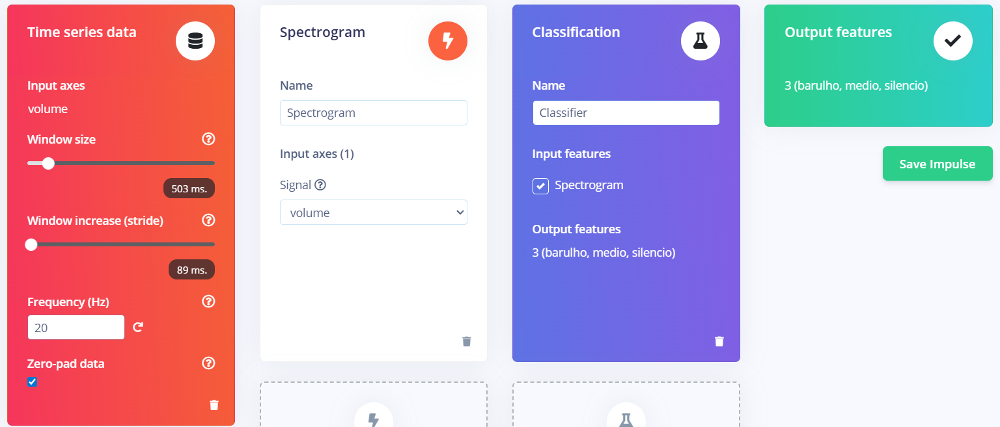

# G2 IOT - Antonio Meneghetti Faculdade
#### Raisson Silveira de Souza

## ESP 32 + Módulo Sensor de Som

O presente trabalho visa utilizar um ESP 32 com um sensor de som para treinar um modelo de classificação no Edge Impulse com as seguintes classes:
- barulho;
- medio;
- silencio.

## Fotos

## Pré Treinamento
Apenas um dado é "printado" pelo ESP 32 no Serial Monitor, sendo a "altura" do volume atual capturado pelo microfone.  

Foram coletados ao todo 12 registros para treinamento e 4 para teste, dividindo o modelo em 75% dos registros para treinamento e 25% para teste, totalizando 1 minuto e 20 segundos de dados.  

Foram utilizados os seguintes parâmetros para a definição inicial do modelo:
- Tamano de janela: 500ms;
- Stride: 89ms
- Frequência: 20Hz.

Utilizado espectrograma para a visualização e dispersão dos dados.
Modelo de classificação.
Classes geradas e determinadas:
- barulho;
- medio;
- silencio.

## Treinamento Inicial

O modelo obteve uma acurácia de 53,9% e uma perda de 0.8, indicando um modelo não eficiente, muito provavelmente devido aos registros utilizados, pois os mesmos tem uma alta proximidade nos dados, sendo a classe "barulho" quase no máximo que o sensor é capaz de obter e médio e silêncio são extremamente próximos, o sensor não é preciso para identificar alterações objetivas no barulho capturado.  

Matriz de confusão obtida com base no primeiro treinamento.  

## Refinamento do Treinamento (Segundo Treinamento)

Acurácia final.  

Métricas finais.  

## Modelo Final Gerado

No fim da configuração do Edge Impulse, fui criado e baixado o modelo final gerado para o trabalho, o mesmo se encontra neste repositório (modelo-treinado.zip).

## Resultados da Classificação

A biblioteca (modelo) gerada para o Arduino foi adicionada no Arduino IDE e compilada no ESP, gerando os seguintes resultados de classificação.  

